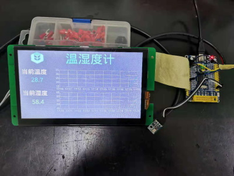
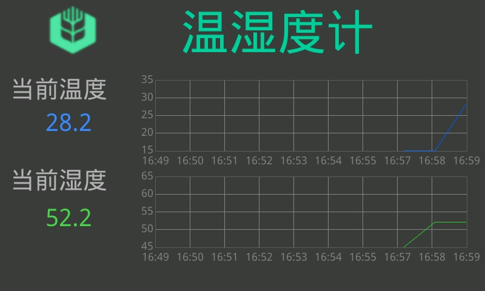

# AHT10 temperature and humidity sensor demo in stm32 hal


The screen using DACAI screen in modbus-rtu mode.


### core source

```c
#include <main.h>
#include <i2c.h>
#include <stdio.h>
#include <usart.h>
#define aht_addr 0x70
int __io_putchar(int ch)
{
	ITM_SendChar(ch);
	return 0;
}
static const uint16_t modbus_crc_table[256] = {
    0x0000, 0xc0c1, 0xc181, 0x0140, 0xc301, 0x03c0, 0x0280, 0xc241, 0xc601, 0x06c0, 0x0780, 0xc741, 0x0500, 0xc5c1,
    0xc481, 0x0440, 0xcc01, 0x0cc0, 0x0d80, 0xcd41, 0x0f00, 0xcfc1, 0xce81, 0x0e40, 0x0a00, 0xcac1, 0xcb81, 0x0b40,
    0xc901, 0x09c0, 0x0880, 0xc841, 0xd801, 0x18c0, 0x1980, 0xd941, 0x1b00, 0xdbc1, 0xda81, 0x1a40, 0x1e00, 0xdec1,
    0xdf81, 0x1f40, 0xdd01, 0x1dc0, 0x1c80, 0xdc41, 0x1400, 0xd4c1, 0xd581, 0x1540, 0xd701, 0x17c0, 0x1680, 0xd641,
    0xd201, 0x12c0, 0x1380, 0xd341, 0x1100, 0xd1c1, 0xd081, 0x1040, 0xf001, 0x30c0, 0x3180, 0xf141, 0x3300, 0xf3c1,
    0xf281, 0x3240, 0x3600, 0xf6c1, 0xf781, 0x3740, 0xf501, 0x35c0, 0x3480, 0xf441, 0x3c00, 0xfcc1, 0xfd81, 0x3d40,
    0xff01, 0x3fc0, 0x3e80, 0xfe41, 0xfa01, 0x3ac0, 0x3b80, 0xfb41, 0x3900, 0xf9c1, 0xf881, 0x3840, 0x2800, 0xe8c1,
    0xe981, 0x2940, 0xeb01, 0x2bc0, 0x2a80, 0xea41, 0xee01, 0x2ec0, 0x2f80, 0xef41, 0x2d00, 0xedc1, 0xec81, 0x2c40,
    0xe401, 0x24c0, 0x2580, 0xe541, 0x2700, 0xe7c1, 0xe681, 0x2640, 0x2200, 0xe2c1, 0xe381, 0x2340, 0xe101, 0x21c0,
    0x2080, 0xe041, 0xa001, 0x60c0, 0x6180, 0xa141, 0x6300, 0xa3c1, 0xa281, 0x6240, 0x6600, 0xa6c1, 0xa781, 0x6740,
    0xa501, 0x65c0, 0x6480, 0xa441, 0x6c00, 0xacc1, 0xad81, 0x6d40, 0xaf01, 0x6fc0, 0x6e80, 0xae41, 0xaa01, 0x6ac0,
    0x6b80, 0xab41, 0x6900, 0xa9c1, 0xa881, 0x6840, 0x7800, 0xb8c1, 0xb981, 0x7940, 0xbb01, 0x7bc0, 0x7a80, 0xba41,
    0xbe01, 0x7ec0, 0x7f80, 0xbf41, 0x7d00, 0xbdc1, 0xbc81, 0x7c40, 0xb401, 0x74c0, 0x7580, 0xb541, 0x7700, 0xb7c1,
    0xb681, 0x7640, 0x7200, 0xb2c1, 0xb381, 0x7340, 0xb101, 0x71c0, 0x7080, 0xb041, 0x5000, 0x90c1, 0x9181, 0x5140,
    0x9301, 0x53c0, 0x5280, 0x9241, 0x9601, 0x56c0, 0x5780, 0x9741, 0x5500, 0x95c1, 0x9481, 0x5440, 0x9c01, 0x5cc0,
    0x5d80, 0x9d41, 0x5f00, 0x9fc1, 0x9e81, 0x5e40, 0x5a00, 0x9ac1, 0x9b81, 0x5b40, 0x9901, 0x59c0, 0x5880, 0x9841,
    0x8801, 0x48c0, 0x4980, 0x8941, 0x4b00, 0x8bc1, 0x8a81, 0x4a40, 0x4e00, 0x8ec1, 0x8f81, 0x4f40, 0x8d01, 0x4dc0,
    0x4c80, 0x8c41, 0x4400, 0x84c1, 0x8581, 0x4540, 0x8701, 0x47c0, 0x4680, 0x8641, 0x8201, 0x42c0, 0x4380, 0x8341,
    0x4100, 0x81c1, 0x8081, 0x4040};

uint16_t hmath_crc_modbus(uint8_t *buffer, uint16_t size)
{
	uint16_t crc = 0xFFFFU;
	uint8_t nTemp;

    while (size--)
    {
        nTemp = *buffer++ ^ crc;
        crc >>= 8;
        crc ^= modbus_crc_table[(nTemp & 0xFFU)];
    }
    return (crc);
}
static inline void frame_build(uint8_t *tx_buf, uint8_t addr, uint8_t func, uint16_t p1, uint16_t p2)
{
    tx_buf[0] = addr;
    tx_buf[1] = func;
    tx_buf[2] = p1 >> 8;
    tx_buf[3] = p1 & 0x00ff;
    tx_buf[4] = p2 >> 8;
    tx_buf[5] = p2 & 0x00ff;
    uint16_t crc16 = hmath_crc_modbus(tx_buf, 6);
    tx_buf[6] = crc16 & 0x00ff;
    tx_buf[7] = crc16 >> 8;
}
void aht10_read()
{
	uint8_t pData[3] = {0xac,0x33,0x00};
	HAL_I2C_Master_Transmit(&hi2c1, aht_addr, pData, 3, 0xffff);
	HAL_Delay(100);
	uint8_t buf[7];
	uint32_t humid,temp;
	float humid_f,temp_f;
	if(HAL_OK == HAL_I2C_Master_Receive(&hi2c1, aht_addr, buf, 6, 0xffff))
	{
		humid = buf[1];
		humid<<=8;
		humid |=buf[2];
		humid<<=4;
		humid|=buf[3]>>4;
		temp = buf[3]&0x0f;
		temp<<=8;
		temp|=buf[4];
		temp<<=8;
		temp|=buf[5];
		humid_f = humid/1048576.0;
		temp_f = (temp/1048576.0)*200-50;
		printf("humid:%lu/%.2f temp:%lu/%.2f\n",humid,humid_f,temp,temp_f);
		uint8_t bus_buf[]={0x01,0x06,0x00,0x00,0x00,0x00,0x00,0x00};
		frame_build(bus_buf,1,6,0,(uint16_t)(temp_f*10));
		HAL_UART_Transmit(&huart1, bus_buf, 8, 0xffff); //temp
		frame_build(bus_buf,1,6,1,(uint16_t)(humid_f*1000));
		HAL_UART_Transmit(&huart1, bus_buf, 8, 0xffff); //humid
	}
}
void system_run()
{
	for(;;)
	{
		aht10_read();
		HAL_Delay(1000);
	}
}
```